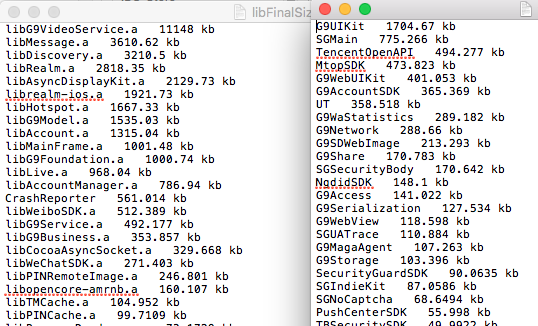

该脚本功能主要是把各个工程所占可执行文件的大小统计出来。

建议clone后放在一个单独的文件下。
中间会产生若干无用的TXT文件，忽略就好。
主要起作用的是这三个脚本：

`function.sh`:
使用方法：传入一个目（工程所在目录），该脚本会遍历该目录下所有的工程配置文件，把每个工程所引用的类提取出来保存为文件.
该脚本运行过后才能运行ProjectStatistic.sh脚本	

`calClassSize.sh`:
使用方法：传入一个类似linkmap.txt的文件，脚本会把每个类及其占用的size提取出来保存成文件，供统计使用。该linkmap.txt文件需要使用者提供。关于怎么生成这个文件请参考[这里](http://blog.cnbang.net/tech/2296/)。
该脚本运行过后才能运行ProjectStatistic.sh脚本	

`ProjectStatistic.sh`:
使用方法：传入一个文件目录（工程所在目录），会把每个工程所使用的类所占用的size全部输出
该脚本依赖function.sh脚本和calClassSize.sh脚本，前两个脚本执行完毕后才最后执行，否则会找不到文件。

具体里的结果在两个文件里，比如静态库的size占用在libFinalSizeListSort.txt里，如果有使用动态库，则frameworkFinalSizeListSort.txt文件会统计各个动态库所占size大小的TXT文件。看名字就知道已经按照size从大到小排好序了。

执行结果见下图：




备注：

因为Mac操作系统兼容性的问题，不同的系统适用sed或gsed，笔者在最初写脚本的时候，发现gsed可以工作，而sed有一些问题，所以calClassSize.sh的第47行使用的是gsed这个工具，如果在终端执行的过程中有报错，根据错误提示进行处理即可。如果未安装gsed则执行

```
 brew install gnu-sed

```

安装即可，如果安装后依然报错，可以试试把gsed替换成sed，测试发现Mac OS X 10.13.5系统需要把gsed替换成sed。